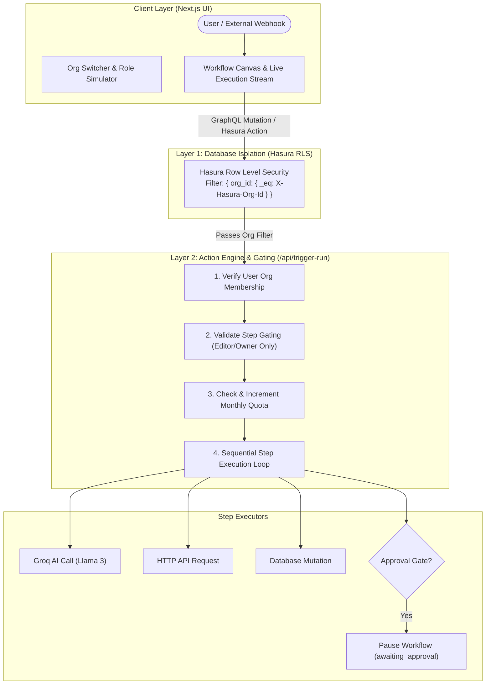
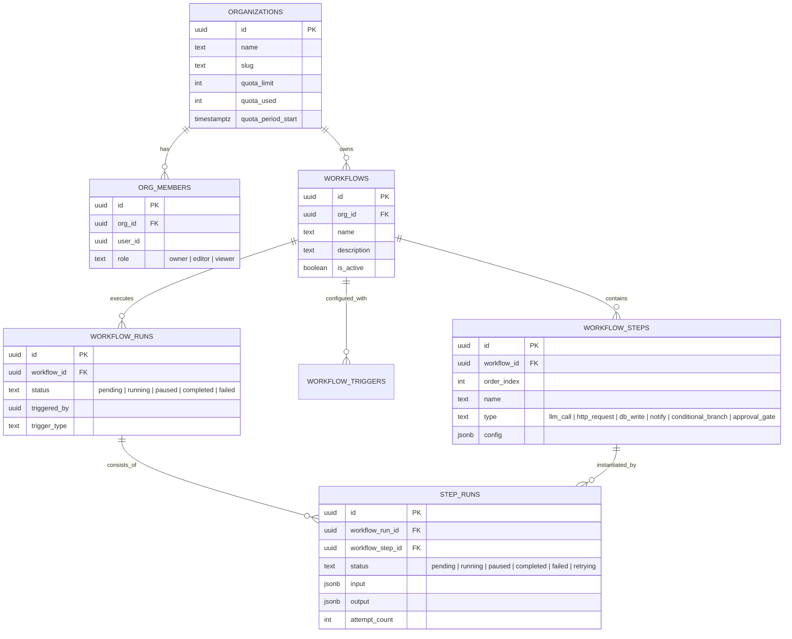

# ⚡ AgentFlow — Autonomous AI Agent Workflow Builder

> **A Mini-n8n Purpose-Built for Autonomous AI Agent Chaining, Built on Nhost + Hasura GraphQL + PostgreSQL + Next.js + Groq AI Engine.**


---

## 📑 Table of Contents
1. [Executive Summary](#-executive-summary)
2. [Key Features](#-key-features)
3. [Technology Stack](#-technology-stack)
4. [System Architecture & 2-Layer Permission Model](#-system-architecture--2-layer-permission-model)
5. [Database Schema & Entity Relationship Diagram](#-database-schema--entity-relationship-diagram)
6. [Supported Step Types & Triggers](#-supported-step-types--triggers)
7. [Step-by-Step Local Setup Guide](#-step-by-step-local-setup-guide)
8. [Deployment Guide (Hasura Cloud + Vercel)](#-deployment-guide-hasura-cloud--vercel)
9. [API & Webhook Trigger Reference](#-api--webhook-trigger-reference)
10. [Live Proof & Scenario Runner](#-live-proof--scenario-runner)

---

## 🌟 Executive Summary

**AgentFlow** is an enterprise-grade, multi-tenant AI workflow orchestration engine. Built for high-pressure AI agent automation, it enables organizations to design, trigger, and observe complex multi-step workflows combining **Groq AI (Llama 3)**, **Conditional Branching**, **External HTTP Calls**, **Database Mutations**, **Event Notifications**, and **Human-in-the-Loop Approval Gates**.

Every single action within AgentFlow is verified against a **Dual-Layer Security Architecture**:
1. **Layer 1 (Database Isolation)**: Multi-tenant organization boundaries enforced at the PostgreSQL/Hasura Row-Level Security (RLS) layer.
2. **Layer 2 (Step-Level Permission Gating)**: Granular Role-Based Access Control (`Owner`, `Editor`, `Viewer`) validating execution rights, quota limits, and step approvals before executing code.

---

## ✨ Key Features

- **🎨 Cyberpunk Dark-Glass Workflow Canvas**: High-end interactive UI with node reordering, live config inspectors, and real-time execution node highlighters.
- **🤖 Groq AI Engine Integration**: Built-in integration with Groq's high-speed inference engine (`llama3-8b-8192`) with exponential retry backoff.
- **⏸️ Human-in-the-Loop Approval Gates**: Workflows pause safely in an `awaiting_approval` state when encountering approval gates, requiring authorized user intervention before proceeding.
- **🔀 Dynamic Conditional Branching**: Evaluate previous step JSON outputs dynamically (e.g. `content contains "production"`) to skip or branch execution paths.
- **📊 Real-Time Execution Stream**: Live visual stream showing status badges, execution timings, retry attempt counts, and step output JSON inspectors.
- **🛡️ Multi-Tenant Organization Switcher**: Live simulation header allowing instant switching between **Organization A** and **Organization B**, and testing **Owner**, **Editor**, and **Viewer** roles to verify security guarantees.
- **⚡ Flexible Workflow Triggers**: Trigger workflows manually, via inbound webhooks, scheduled crons, or database mutation events.

---

## 🛠️ Technology Stack

| Layer | Technology | Usage / Purpose |
| :--- | :--- | :--- |
| **Frontend Framework** | **Next.js 16 (App Router)** | React Server & Client Components, Responsive Glassmorphism Design |
| **Styling System** | **Tailwind CSS v3 + CSS Custom Properties** | Custom Cyberpunk Dark theme, Glows, Glassmorphism panels |
| **Backend & GraphQL** | **Hasura GraphQL Engine / Nhost** | Instant GraphQL API, PostgreSQL RLS, Webhooks & Event Triggers |
| **Database** | **PostgreSQL 15** | Relational schema, JSONB payloads, computed usage views |
| **AI LLM Engine** | **Groq SDK (Llama 3 8B)** | Ultra-fast AI step inference & prompt routing |
| **GraphQL Client** | **Apollo Client + Subscriptions** | Queries, Mutations, and real-time WebSocket subscriptions |
| **Icons & UI Components** | **Lucide React + Radix UI** | Modern vector icon set and accessible UI primitives |

---

## 🏗️ System Architecture & 2-Layer Permission Model



### 🔒 Permission Layers Breakdown

| Layer | Enforced At | Description | What It Protects |
| :--- | :--- | :--- | :--- |
| **Layer 1: DB Row Isolation** | PostgreSQL / Hasura RLS | Embeds `x-hasura-org-id` into session claims. SQL queries automatically append `WHERE org_id = session.org_id`. | Prevents Org A from querying or mutating Org B's workflows even if direct UUIDs are guessed. |
| **Layer 2: Step-Level Gating** | Next.js API Routes / Hasura Actions | Checks user's role (`owner`, `editor`, `viewer`) in `org_members` table against step type execution permissions. | Prevents `viewer` users from triggering runs, executing AI steps, or approving gates. |

---

## 🗄️ Database Schema & Entity Relationship Diagram



---

## ⚡ Supported Step Types & Triggers

### 📦 6 Core Step Types
1. `llm_call`: Prompts Groq AI (`llama3-8b-8192`) with previous step variable substitution.
2. `http_request`: Sends HTTP `GET`/`POST`/`PUT`/`DELETE` requests to external APIs.
3. `db_write`: Executes structured JSON data mutations into PostgreSQL tables.
4. `notify`: Dispatches webhook or Slack alerts to designated channels.
5. `conditional_branch`: Evaluates Boolean expressions on previous step outputs to skip or divert steps.
6. `approval_gate`: Pauses workflow execution until an `editor` or `owner` approves the step.

### 🎯 4 Trigger Types
1. `manual`: Triggered on-demand via the dashboard UI or GraphQL mutation.
2. `webhook`: Triggered externally via standard HTTP POST to `/api/webhook-trigger`.
3. `scheduled`: Triggered periodically via cron schedule.
4. `db_event`: Triggered automatically on PostgreSQL table inserts/updates via Hasura Event Triggers.

---

## 🚀 Step-by-Step Local Setup Guide

### Prerequisites
- **Node.js**: v18.0.0 or higher
- **npm** / **yarn** / **pnpm**
- **Git**

### 1. Clone the Repository
```bash
git clone https://github.com/vinaybabannavar-create/AI-Agent-Workflow-Builder.git
cd AI-Agent-Workflow-Builder/app
```

### 2. Install Dependencies
```bash
npm install --legacy-peer-deps
```

### 3. Configure Environment Variables
Create a `.env.local` file inside the `app/` folder:

```env
# Nhost / Hasura Config
NEXT_PUBLIC_NHOST_SUBDOMAIN=your-subdomain
NEXT_PUBLIC_NHOST_REGION=ap-south-1
NHOST_ADMIN_SECRET=your-hasura-admin-secret

# Groq AI API Key (For LLM step execution)
GROQ_API_KEY=gsk_your_groq_api_key_here

# Next.js API Base URL
ACTION_BASE_URL=http://localhost:3000
HASURA_EVENT_SECRET=your-event-secret
```

### 4. Apply Database Migrations (Hasura)
If using the Hasura CLI locally or pointing to Nhost:
```bash
cd ../hasura
hasura migrate apply --endpoint http://localhost:8080 --admin-secret your-hasura-admin-secret
hasura metadata apply --endpoint http://localhost:8080 --admin-secret your-hasura-admin-secret
```

### 5. Start the Next.js Development Server
```bash
cd ../app
npm run dev
```

Open **[http://localhost:3000](http://localhost:3000)** in your browser to access the dashboard!

---

## ☁️ Deployment Guide (Hasura Cloud + Vercel)

### 1. Deploy Frontend to Vercel
1. Push your repository to GitHub.
2. Import your repository in [Vercel](https://vercel.com).
3. Set the **Root Directory** to `app`.
4. Add environment variables:
   - `GROQ_API_KEY`
   - `NHOST_ADMIN_SECRET`
   - `ACTION_BASE_URL` (your Vercel URL e.g. `https://your-app.vercel.app`)
5. Click **Deploy**.

### 2. Deploy Backend & Database to Nhost / Hasura Cloud
1. Create a new project on [Nhost.io](https://nhost.io) or [Hasura Cloud](https://cloud.hasura.io).
2. Connect your PostgreSQL database.
3. Apply `hasura/migrations/1_init/up.sql` via SQL Console or Hasura CLI.
4. Import `hasura/metadata` to apply permissions and Action definitions.
5. Set `ACTION_BASE_URL` in Hasura environment to point to your Vercel deployment URL.

---

## 📡 API & Webhook Trigger Reference

### Inbound Webhook Trigger Endpoint
```http
POST /api/webhook-trigger
Content-Type: application/json
x-webhook-secret: secret-key-123

{
  "workflow_id": "wf-org-a-1",
  "org_id": "11111111-1111-1111-1111-111111111111",
  "payload": {
    "ticket_title": "Production Server Outage",
    "severity": "critical"
  }
}
```

#### Success Response
```json
{
  "success": true,
  "run_id": "run-98421421",
  "status": "completed",
  "executed_steps_count": 5
}
```

---

## 🧪 Live Proof & Scenario Runner

The application includes an interactive **Live Scenario Proof Runner** built directly into the UI dashboard:

1. **Cross-Org Isolation Test**: Select **Organization A** and attempt to trigger an **Organization B** workflow ID (`wf-org-b-1`). Watch the system block the request at the Layer 1 security boundary!
2. **Role Permission Test**: Switch to **Viewer** role and attempt to run a workflow or approve a gate step. Watch Layer 2 security safely deny execution rights.
3. **Approval Gate Test**: Run the default Customer Support AI Router workflow. Observe it pause automatically at Step 4 (`Require Escalation Gate`), and resume execution instantly when an **Editor** or **Owner** clicks **Approve**.

---

## 📜 License
Licensed under the [MIT License](LICENSE). Built for high-speed AI Agent workflow deployment.